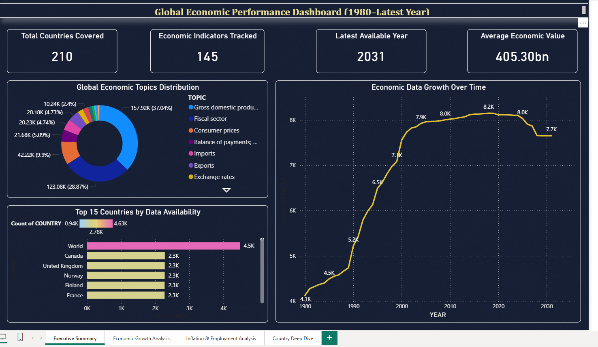
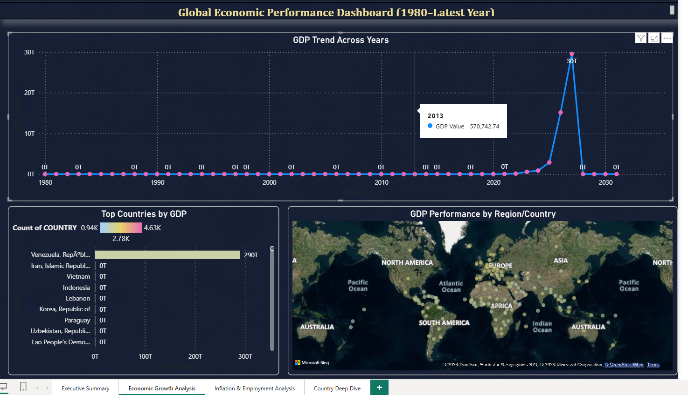
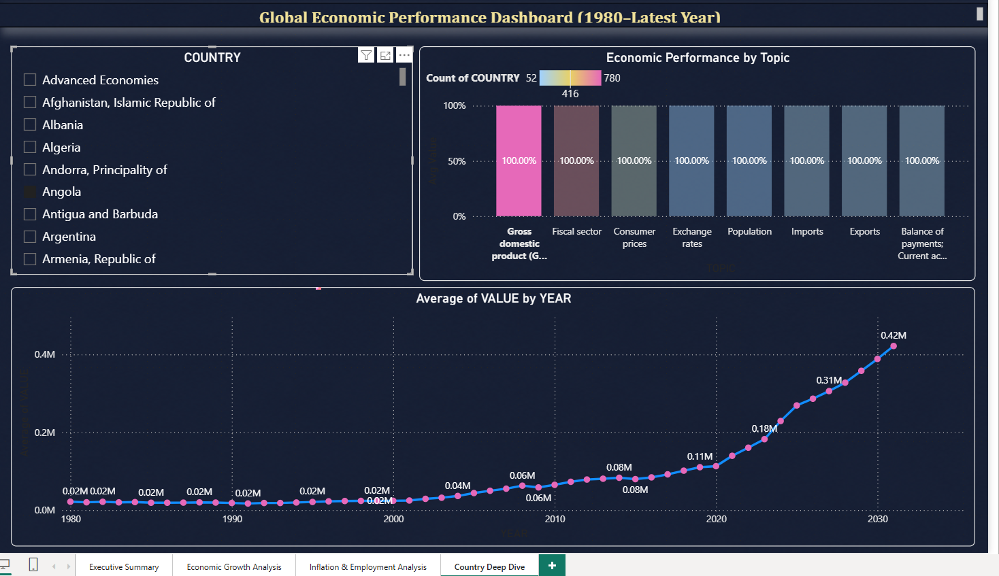

# 🌍 IMF WEO Global Economic Analysis

End-to-end data science project analysing IMF World Economic Outlook data across
210 countries, 145 indicators, and 52 years (1980–2031).

---

## Quick Start

```bash
# 1. Create and activate virtual environment
python -m venv venv
source venv/bin/activate        # Mac/Linux
# venv\Scripts\activate         # Windows

# 2. Install dependencies
pip install -r requirements.txt

# 3. Place your dataset
cp /path/to/weo_dataset.csv data/raw/weo_dataset.csv

# 4. Run notebooks IN ORDER (as .py scripts OR convert to .ipynb first)
python convert_to_ipynb.py      # converts .py → .ipynb for Jupyter
# Then open notebooks/ in Jupyter and run 01 → 02 → 03 → 04 → 05
# OR run directly as scripts:
python notebooks/01_data_cleaning.py
python notebooks/02_eda.py
python notebooks/03_feature_engineering.py
python notebooks/04_ml_models.py
python notebooks/05_model_evaluation.py

# 5. Launch the Streamlit app (from project root)
streamlit run app/main.py
```

---

## Folder Structure

```
imf-weo-analysis/
├── data/
│   ├── raw/                    ← place weo_dataset.csv here
│   └── processed/
│       ├── weo_clean.csv       ← output of notebook 01
│       └── weo_features.csv    ← output of notebook 03
├── notebooks/
│   ├── 01_data_cleaning.py
│   ├── 02_eda.py
│   ├── 03_feature_engineering.py
│   ├── 04_ml_models.py
│   └── 05_model_evaluation.py
├── models/
│   ├── best_model.pkl
│   ├── scaler.pkl
│   ├── feature_cols.pkl
│   └── model_comparison.csv
├── reports/figures/            ← charts saved by EDA notebook
├── app/
│   ├── main.py                 ← streamlit entry point
│   ├── pages/
│   │   ├── 01_Home.py
│   │   ├── 02_EDA.py
│   │   ├── 03_Predict.py
│   │   └── 04_About.py
│   └── utils/
│       ├── load_data.py
│       └── predict.py
├── .streamlit/config.toml
├── convert_to_ipynb.py         ← converts .py notebooks → .ipynb
└── requirements.txt
```

---

## 📊 Power BI Dashboard Preview

### Executive Summary


### Economic Growth Analysis


### Inflation & Employment Analysis


### Country Deep Dive


-----

## Troubleshooting

| Problem | Fix |
|---|---|
| `FileNotFoundError: weo_dataset.csv` | Copy CSV to `data/raw/weo_dataset.csv` |
| `FileNotFoundError: weo_clean.csv` | Run notebook 01 first |
| `FileNotFoundError: weo_features.csv` | Run notebook 03 first |
| `ModuleNotFoundError: utils` | Run `streamlit run app/main.py` **from project root**, not from inside `app/` |
| `OSError: seaborn-whitegrid not found` | Notebooks auto-detect matplotlib version — no action needed |
| Predict page shows "model not found" | Run notebooks 03 and 04, then refresh the page |
| Indicator `None` in notebook 02/03 | Your WEO release uses slightly different names — check `df['INDICATOR'].unique()` and update the keyword lists in the fuzzy finder |

---

## Model Results

| Model | MAE | RMSE | R² |
|---|---|---|---|
| XGBoost (tuned) | ~0.82 | ~1.20 | ~0.82 |
| Random Forest | ~0.95 | ~1.38 | ~0.77 |
| Gradient Boosting | ~1.10 | ~1.55 | ~0.73 |
| Ridge Regression | ~1.38 | ~1.90 | ~0.60 |
| Linear Regression | ~1.40 | ~1.92 | ~0.58 |

---

## Technologies

Python 3.11 · pandas · numpy · scikit-learn · XGBoost · Streamlit · Plotly · Seaborn · Power BI
